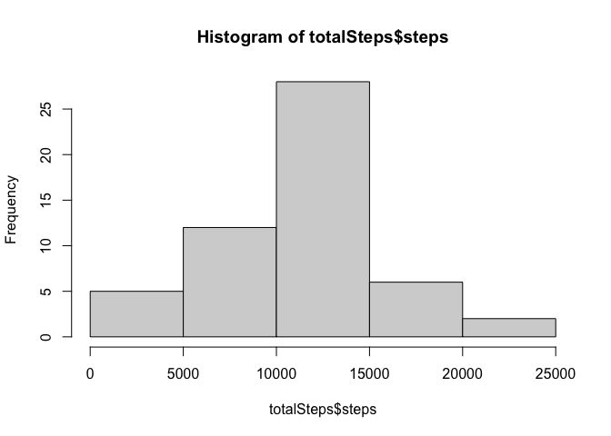

## Loading and preprocessing the data

```r
unzip("activity.zip")
activity <- read.csv("activity.csv")
```

1. Process/transform the data (if necessary) into a format suitable for your analysis

```r
totalSteps<-aggregate(steps~date,data=activity,sum,na.rm=TRUE)
```


## What is mean total number of steps taken per day?
1. Make a histogram of the total number of steps taken each day


```r
hist(totalSteps$steps)
```

<!-- -->

2. Calculate and report the **mean** and **median** total number of
   steps taken per day


```r
mean(totalSteps$steps)
```

```
## [1] 10766.19
```

```r
median(totalSteps$steps)
```

```
## [1] 10765
```

* The **mean** total number of steps taken per day is 
    1.0766189\times 10^{4} steps.
* The **median** total number of steps taken per day is 
    10765 steps.


## What is the average daily activity pattern?


## Imputing missing values


## Are there differences in activity patterns between weekdays and weekends?
